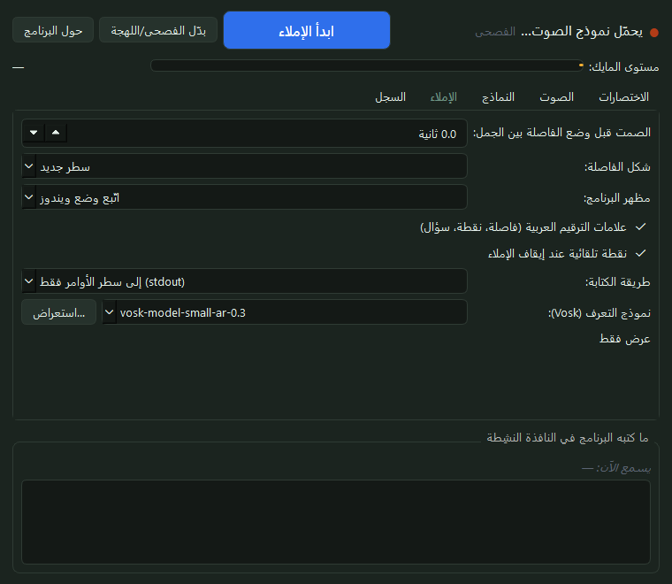
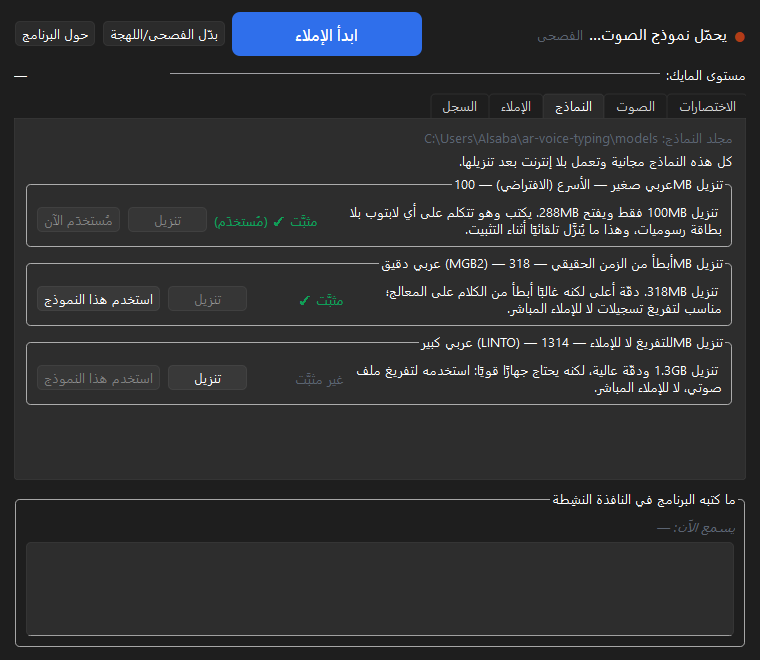
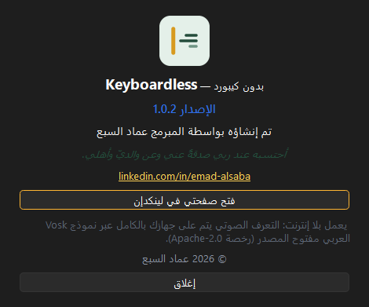

<div dir="rtl" align="right">

# Keyboardless — بدون كيبورد

**إملاء صوتي عربي على ويندوز — تكتب بكلامك، ولا يحتاج إنترنت بعد التثبيت.**

<p align="center"></p>

> **إهداء:** «أحتسبه عند ربي صدقةً عني وعن والديّ وأهلي.»

| | |
|---|---|
| **المبرمج** | عماد السبع — [لينكدإن](https://www.linkedin.com/in/emad-alsaba) |
| **الإصدار** | 1.0.2 |
| **المنصة** | ويندوز 10/11 (64 بت) |
| **المحرّك** | Vosk — تعرّف صوتي عربي يعمل محليًا بلا إنترنت |

---

## ما هو؟

برنامج صغير يجلس في **أيقونة بجانب الساعة**، وعند الضغط على مفتاح واحد تبدأ الكتابة في أي برنامج
تكتب فيه: Word، المتصفح، Outlook، واتساب… **الكلام يظهر حرفًا بحرف أثناء تحدّثك**، لا بعد انتهاء
الجملة. كل المعالجة على جهازك — لا يُرسل صوتك ولا نصّك إلى أي جهة.

## المزايا

| الميزة | التفصيل |
|---|---|
| **كتابة مباشرة متدفّقة** | الكلمات تظهر أثناء الكلام، ويُصحّح النص الجزئي تلقائيًا بلا تكرار |
| **بلا إنترنت** | التعرّف يجري محليًا بنموذج مفتوح المصدر؛ لا حساب ولا اشتراك ولا إرسال بيانات |
| **عربي فصيح ولهجة** | وضعان بتبديل فوري: الفصحى، واللهجة السعودية |
| **أيقونة جانبية كاملة** | استماع · صمت · صفحة البرنامج · إغلاق تمامًا — والأيقونة تُظهر الحالة |
| **مظهر يختاره المستخدم** | داكن، أو ألوان ويندوز، أو اتّباع إعدادات ويندوز تلقائيًا |
| **رفع تلقائي للصوت الهادئ** | يرفع مستوى المايك الضعيف تلقائيًا بدل أن يبقى صامتًا |
| **علامات ترقيم بالكلام** | قل «فاصلة» أو «نقطة» أو «سؤال» فيكتبها |
| **فواصل الجمل** | بعد صمت بمدة تحدّدها (وأجزاء الثانية) يضع فاصلة/سطرًا جديدًا تلقائيًا |
| **اختصارات يخصّصها المستخدم** | بملتقط مفاتيح داخل النافذة، مع فحص هل المفتاح محجوز لبرنامج آخر |
| **حجم صغير** | المثبّت **39 ميجابايت**، ونموذج اللغة (100 ميجابايت) يُنزَّل أثناء التثبيت مرة واحدة |

## لقطات

| النافذة | النماذج |
|---|---|
|  |  |

| جاهز | يُنصت | موقوف | أحادية اللون |
|---|---|---|---|
|  |  |  |  |

نافذة «حول البرنامج»: 

---

## التثبيت

### أ) بالمثبّت (الطريقة العادية)

1. نزّل `Keyboardless-Setup-x.y.z.exe` من صفحة **Releases**.
2. انقر مزدوجًا ← «التالي» ← «تثبيت». **لا أسئلة ولا صلاحيات مدير.**
3. أثناء التثبيت يظهر سطر حالة: «يُنزَّل نموذج اللغة العربية (100MB تقريبًا)» ثم ينتهي وحده.

المكان: `%LOCALAPPDATA%\Programs\Keyboardless` — والنموذج والإعدادات في `%LOCALAPPDATA%\Keyboardless`.
التثبيت لا يمسّ ملفات النظام، وإلغاء التثبيت يحذف النموذج ويُبقي إعداداتك.

### ب) من المصدر (لمن يريد التعديل)

```powershell
git clone https://github.com/emadalsaba/keyboardless.git
cd keyboardless
powershell -ExecutionPolicy Bypass -File app\install_windows.ps1
```

المثبّت يُنشئ بيئة بايثون وينزّل المتطلبات والنموذج، ثم شغّل `keyboardless-gui.cmd`.

---

## الاستخدام

### الاختصارات (قابلة للتغيير)

| الاختصار | الوظيفة |
|---|---|
| `Ctrl+Alt+D` (أو `Ctrl+Alt+J`) | بدء الإملاء / إيقافه |
| `Ctrl+Alt+M` | تبديل الفصحى ⇄ اللهجة |
| `Ctrl+Alt+Q` | إغلاق البرنامج |

الطريقة: افتح البرنامج الذي تريد الكتابة فيه ← ضع المؤشر في الحقل ← اضغط الاختصار ← تكلّم.
اضغط الاختصار ثانيةً للإيقاف.

### الأيقونة الجانبية (بالزر الأيمن)

**استماع** (يبدأ الإملاء) · **صمت** (يوقفه والبرنامج يبقى في الخلفية) · **صفحة البرنامج** ·
تبديل الفصحى/اللهجة · **حول البرنامج** · **إغلاق تمامًا**.

الأيقونة تُظهر الحالة: جاهز في السكون، **يُنصت** (أعمدة صوت بخلفية عنبرية) أثناء الإملاء.

> ويندوز ١١ يُخفي الأيقونات الجديدة داخل منطقة «‎…» في شريط المهام: اسحب الأيقونة منه إلى الشريط،
> أو من الإعدادات ← التخصيص ← شريط المهام ← أيقونات علبة النظام ← شغّل Keyboardless.

### من سطر الأوامر

```bat
Keyboardless.exe --cli --about              :: معلومات البرنامج
Keyboardless.exe --cli --models             :: النماذج المتاحة والمثبّتة وأين
Keyboardless.exe --cli --ensure-model       :: تنزيل النموذج العربي إلى المسار المخصص
Keyboardless.exe --cli --mic-level 5        :: قياس مستوى المايك (5 ثوانٍ) والنص المُفهوم
Keyboardless.exe --cli --check-hotkeys      :: هل الاختصار محجوز لبرنامج آخر؟
Keyboardless.exe --cli --wav file.wav       :: تفريغ ملف صوتي (16kHz أحادي)
```

النص يظهر في الطرفية، وتُحفظ نسخة من كل تشغيل في `%LOCALAPPDATA%\Keyboardless\cli-last.txt`.

---

## الإعدادات

تُحفظ في `config.json` (نسخة المشروع: `app\config.json`، والنسخة المثبَّتة:
`%LOCALAPPDATA%\Keyboardless\config.json`) — وكل ما في النافذة يُكتب هناك، فالإعداد **مصدر واحد**
يستعمله البرنامج وسطر الأوامر معًا.

| المفتاح | المعنى |
|---|---|
| `model` | مسار نموذج التعرّف |
| `mode` | `msa` فصحى أو `dialect` لهجة |
| `hotkey` / `mode_key` / `quit_key` | الاختصارات (تقبل أكثر من مفتاح احتياطي) |
| `device` | مدخل المايك (`null` = الافتراضي للنظام) |
| `agc` / `agc_target` | الرفع التلقائي للصوت الهادئ ومستواه |
| `pause_seconds` / `pause_sep` | مدة الصمت قبل الفاصلة، وشكل الفاصلة (`\n` · `.` · `،` · `:`) |
| `appearance` | المظهر: `system` · `dark` · `light` |
| `punctuation` / `auto_period` | تحويل الأوامر الصوتية إلى ترقيم، ونقطة عند الإيقاف |
| `injector` | طريقة الكتابة: `sendinput` (الافتراضي) · `clipboard` (لبعض برامج المتجر) · `stdout` |
| `log` | مسار ملف السجل |

## النماذج العربية المجانية

كلها مجانية ومفتوحة المصدر وتعمل بلا إنترنت بعد تنزيلها مرة واحدة، من داخل البرنامج (تبويب
«النماذج») أو بالمثبّت تلقائيًا:

| النموذج | حجم التنزيل | متى تستخدمه |
|---|---|---|
| `vosk-model-small-ar-0.3` | 100MB | **الافتراضي** — إملاء مباشر على أي جهاز |
| `vosk-model-ar-mgb2-0.4` | 318MB | دقة أعلى، لكنه أبطأ من الكلام على المعالج |
| `vosk-model-ar-0.22-linto-1.1.0` | 1.3GB | دقة عالية لتفريغ تسجيلات، لا للإملاء المباشر |

---

## حلّ المشاكل

| ما تراه | السبب والحل |
|---|---|
| **الاختصار لا يعمل** | تأكّد أن البرنامج يعمل (الأيقونة في العلبة)، ثم افحص الحجز: `--cli --check-hotkeys`. بعض البرامج (مثل Claude) تحجز مفاتيح لنفسها فتذهب الضغطة إليها. |
| **يُكتب «بدء الإملاء» ولا يُكتب نص** | مستوى المايك منخفض: `--cli --mic-level 5` يطبع المستوى والكسب. الرفع التلقائي مفعّل افتراضيًا، وارفع «حساسية استماع الصوت» إن لزم. |
| **لا يظهر البرنامج بجانب الساعة** | ويندوز يخفي الأيقونات الجديدة في منطقة «‎…»: اسحبها إلى شريط المهام، أو الأيقونات ← فعّل Keyboardless. |
| **الكتابة تظهر في النافذة الخطأ** | ضع المؤشر في الحقل المطلوب **قبل** بدء الإملاء. |
| **برنامج معيّن لا يقبل الكتابة** | بدّل «طريقة الكتابة» إلى `clipboard` من النافذة. |
| **بطء مع الكلام الطويل** | أنت على نموذج كبير: ارجع إلى النموذج الافتراضي من تبويب «النماذج». |

مزيد من التفصيل في [دليل الاستخدام](docs/users-guide.md).

## البناء من المصدر (للمطورين)

```powershell
powershell -ExecutionPolicy Bypass -File app\packaging\build_windows.ps1 -Installer
```

يُنتج `dist\Keyboardless\` (التطبيق) و`dist\installer\Keyboardless-Setup-x.y.z.exe`.
يتطلّب PyInstaller، ويحتاج Inno Setup 6 لتصريف المثبّت فقط.

## بنية المشروع

```
app/
  ar_dictate.py      المحرّك: التعرّف المتدفّق، الاختصارات، الحقن، الإعدادات
  gui.py             النافذة والأيقونة الجانبية (PySide6)
  app_icons.py       أيقونات الحالات الأربع وبناء ملف .ico
  app_theme.py       المظهر الفاتح/الداكن وألوان التصميم
  model_store.py     تنزيل النماذج العربية (استكمال + رفض الأرشيف غير الآمن)
  inject_win.py      كتابة النص في النافذة النشِطة (SendInput / حافظة)
  postprocess.py     ترقيم عربي، أوامر صوتية، لهجة
  streaming.py       منطق تثبيت الكلمات (LocalAgreement-2)
  branding.py        اسم المنتج والإصدار والمؤلف والإهداء (مصدر واحد)
  assets/icons/      تصميم الأيقونة (4 حالات × 8 مقاسات + SVG)
  tests/             أكثر من 200 اختبارًا
  packaging/         PyInstaller + Inno Setup + أيقونة ويندوز
docs/                دليل الاستخدام وملاحظات المطوّر
```

## الاختبارات

```bash
python -m unittest discover -s app/tests
```

أكثر من **200 اختبار** تغطّي المحرّك، الاختصارات، الترقيم، المظهر، الأيقونات، النماذج، التغليف،
والتثبيت — منها اختبارات تمنع أخطاء وقعت فعلًا (نشر نصف محرّك، اسم نموذج غير موجود، تعارض مفاتيح).

## الرخصة

سيُحدَّد هنا (راجع طلب المالك): مقترح **MIT** — حرّ للاستخدام والتعديل مع حفظ اسم المؤلف.

---

<p align="center">
<b>Keyboardless — بدون كيبورد</b><br>
«أحتسبه عند ربي صدقةً عني وعن والديّ وأهلي.»<br>
© 2026 عماد السبع — <a href="https://www.linkedin.com/in/emad-alsaba">لينكدإن</a>
</p>

</div>

